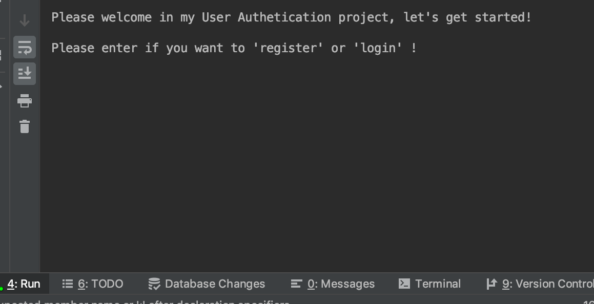
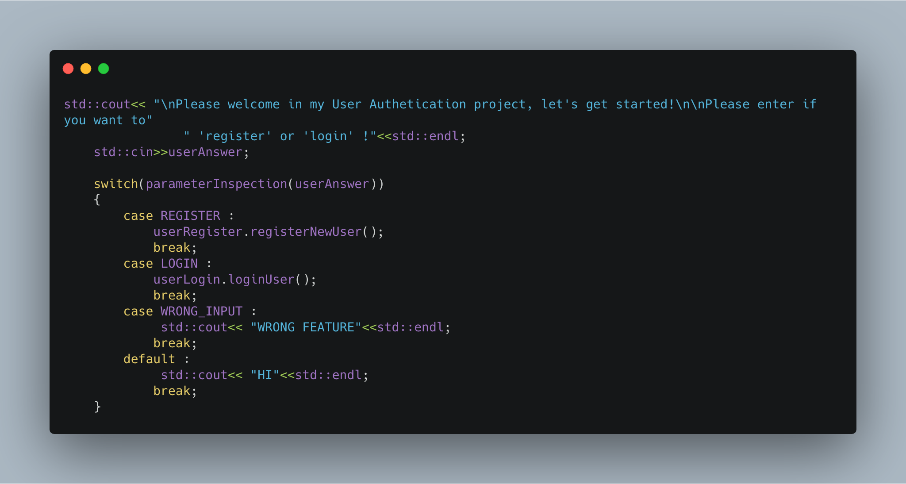
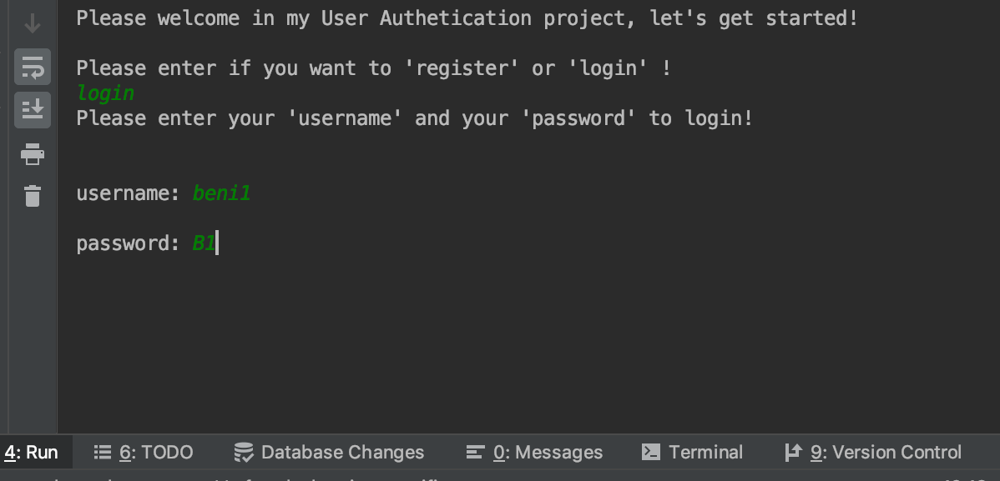
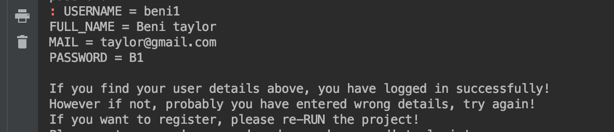
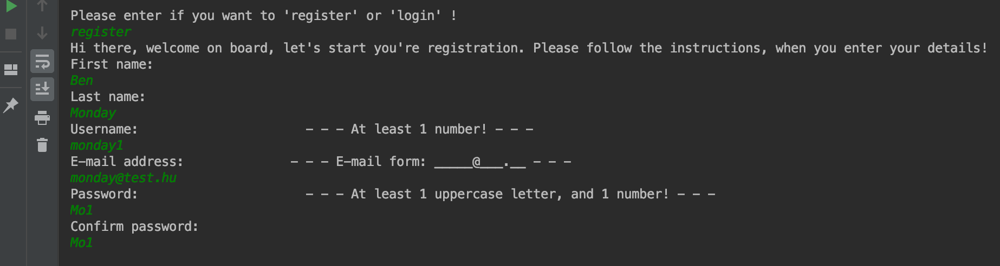
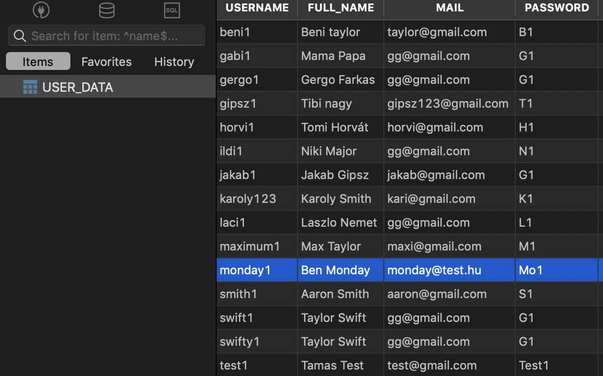

# User Authentication Project  

- _created by_ [Tamás Németh](https://www.linkedin.com/in/tam%C3%A1s-n%C3%A9meth-793459161/)  
- _gitHub:_ [ithomas91](https://github.com/ithomas91)  
- _used technology:_ [C++14](https://en.wikipedia.org/wiki/C%2B%2B14)  
- _used compiler:_ [CLion by JetBrains](https://www.jetbrains.com/clion/download)  
- _database engine:_ [SQLite3](https://www.sqlite.org/index.html)  

## Project documentation  

User Authentication project dreamed by me. I used c++ programming language, due to my knowledge.
The program has to be run by compiler. It has got database which store Users data.
 

`NOTE: ALL USER DATA IN DATABASE ARE FAKE!`

 

## List of available features with examples

 

- ### At the beginning, the User can go 2 different ways, 'login' or 'registration'. 

 
 
  
  
- ### At the 'login' feature prompt the User to enter 'Username' and 'Password', and looking for a match in database. If the entered details are matching, all User data are show up.

 

 

- ### At the 'register' feature prompt the User to enter 'First name', 'Last name', 'Username', 'E-mail address', 'Password' and 'Confirm password'.

 

There are some criterion to register: 

- username has to be unique, contain one number at least 
- e-mail address formal has to be followed 
- password has to contain at least one uppercase letter, and one number 
- user has to confirm the password 
 

`NOTE: ALL USER DATA IN DATABASE ARE FAKE!`

 

### If a condition isn't met, the program drops the user to the beginning of the registration.
 
